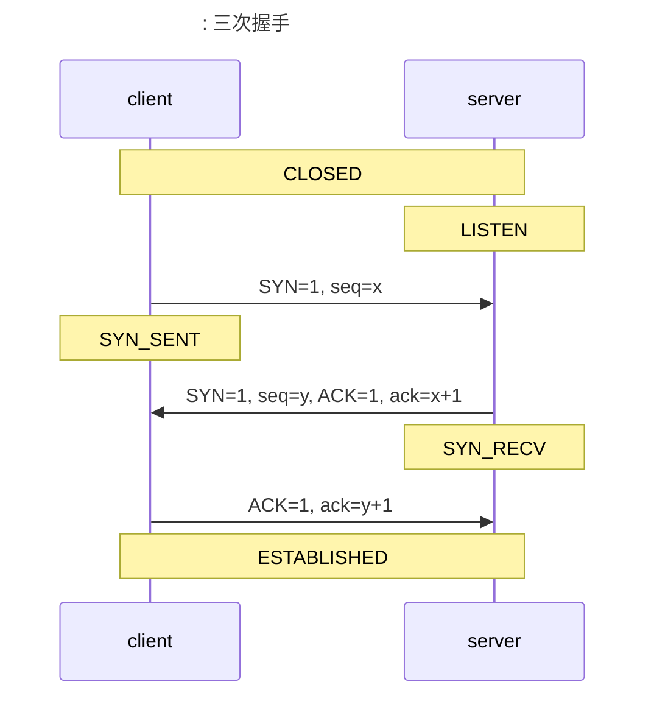
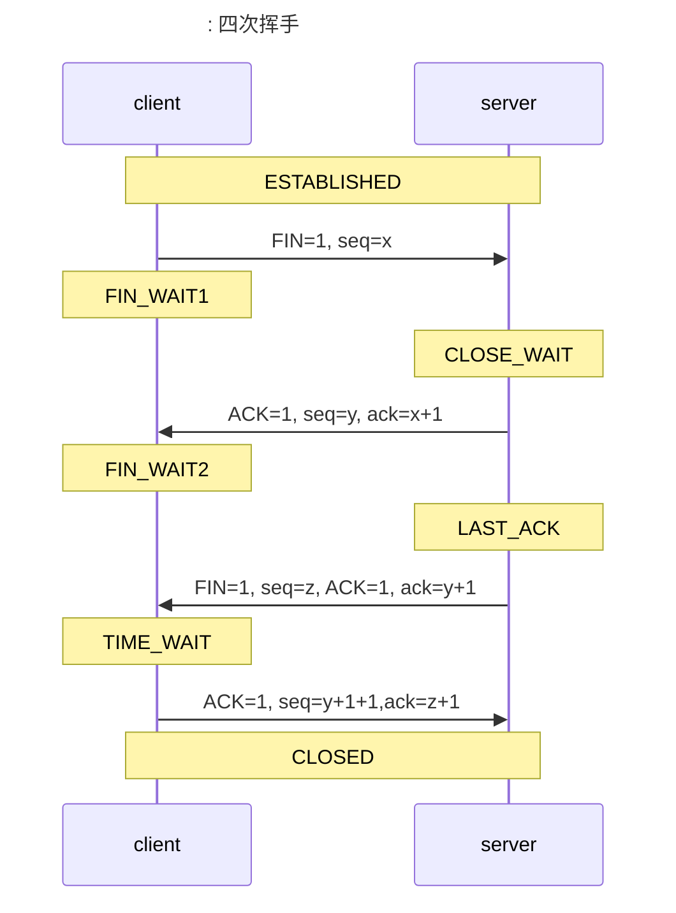

+++
title = '网络相关.md'
date = 2023-11-09T15:56:46+08:00
draft = true
+++

# 网络相关

## OSI 七层模型

1. 应用层：为应用程序提供网络服务。
2. 表示层：用户处理在两个通信系统中交换信息的表示方式，语法转换、语法选择、连接管理。
3. 会话层：为会话实体建立连接、维护数据传输、释放连接。
4. 传输层：为用户提供端到端服务，分割重组数据、按端口号寻址、联接管理、差错控制和流量控制、纠错功能，TCP 协议就在这一层。
5. 网络层：分组与分组交换、路由、网络连接复用、差错检测与恢复、服务选择、网络管理、流量控制、阻塞控制、网络互联、分片与重组，IP 协议在这一层。
6. 数据链路层：基本传输单位为“帧”，最基本的功能是将来自网络层的数据可靠地传输到相邻节点的目标及网络层。又被分为逻辑链路控制（LLC）协议和媒体访问控制（MAC）协议。主要提供帧编码和误差纠正控制两个功能。
7. 物理层：处于最底层，为传输数据所需要的物理链路创建、维持、拆除，而提供具有机械的、电子的、功能的和规范的特性。

## TCP/IP

> LITSEN 监听状态
>
> SYN_SENT 同步已发送
>
> SYN_RCVD 同步已收到
>
> ESTABLISHED 已建立连接

为什么三次握手而不是两次，客户端需要发送普通连接确认，是为了避免因为网络延迟等原因而导致的已经失效的连接请求又突然发送到服务器，而此时可能客户端已经完成数据传输而关闭，服务器却认为连接已建立，当服务器返回确认信息时因为客户端已经关闭而并没有真正建立连接，一方面连接状态是错误的，另一方面在一段时间内白白浪费了服务器的资源。

> FIN_WAIT1 终止等待1
>
> CLOSE_WAIT 关闭等待
>
> FIN_WAIT2 终止等待2
>
> LAST_ACK 最后确认
>
> TIME_WAIT 时间等待

### TCP 与 UDP

|          | TCP 可靠的、字节流服务                               | UDP 不可靠的、数据报服务               |
| -------- | ---------------------------------------------------- | -------------------------------------- |
| 面向     | 面向单一目标，面向连接的字节流协议                   | 可以面向多个目标，面向无连接的报文协议 |
| 可靠性   | 可靠的，可以保证数据无差错、不重复、不丢失、按需到达 | 不可靠，只保证发送                     |
| 消息大小 | 协议头比较大，占用 20 个字节到 60 个字节             | 协议头小，8 字节                       |

### TCP 流量控制

接收方会根据可接收的数据缓存大小来决定接收窗口的大小，并在确认消息中返回给发送方，发送方则相应的调整自己的发送窗口，这样就避免了发送方发送数据过快而导致接收方无法处理数据的问题。

### TCP 拥塞控制

在某段时间，若对网络中某一资源的需求超过了该资源所能提供的可用部分，网络性能就要变坏。这种情况就叫做拥塞（congestion）。

发送方维护一个叫做拥塞窗口 cwnd 的状态变量，齐值取决于网络的拥塞程度，并且动态变化。

- 拥塞窗口 cwnd 的维护原则：只要网络没有出现拥塞，拥塞窗口就再增大一些；但只要网络出现拥塞，拥塞窗口就减少一些。
- 判断出现网络拥塞的依据：没有按时收到应当到达的确认。

发送方将拥塞窗口作为发送窗口 swnd，即 swnd = cwnd

维护一个慢开始门限 ssthresh 状态变量：

- 当 cwnd < ssthresh 时，使用慢开始宣发；
- 当 cwnd > ssthresh 时，停止使用慢开始算法而改用拥塞避免算法；
- 当 cwnd = ssthresh 时，既可以使用慢开始算法，也可以使用拥塞避免算法。

#### 慢开始算法

窗口每次增长一倍（按指数规律增大）

#### 拥塞避免算法

窗口每次只加 1（按线性加 1 规律增大）

#### 算法的选择

发送方一开始使用慢开始算法，每次收到确认信息后，发送窗口增大一倍，当发送窗口大于慢开始门限的值后，改为拥塞避免算法，每次收到确认信息后，发送窗口大小增加 1。根据接收方返回的确认消息，如果发生传输错误，我们就认为出现了网络拥塞，则将慢开始门限值取当前拥塞窗口值的一半，然后重新使用慢开始算法

#### 快重传

是为了解决网络并未发生拥塞时个别报文段丢失的问题

- 当发生数据丢失时，接收方不要等待自己发送数据时捎带确认，而是要立即发送确认；
- 及时收到失序报文段，也要立即发触对已收到报文段的重复确认；
- 发送方一旦收到 3 个连续的重复确认，就将相应的报文段立即重传，而不是等该报文段的超时重传计时器超时再重传；
- 对于个别丢失的报文段，发送方不会出现超时重传，也就不会误认为出现了拥塞。使用块重传可以使整个网络的吞吐量提高约 20%。

#### 快恢复

发送方收到 3 个连续的重复确认，触发快恢复算法，将慢开始门限值取值为当前值的一半，并将发送窗口值设置为慢开始门限值，然后开始执行拥塞避免算法

## session 和 cookie

|          | session  | cookie                             |
| -------- | -------- | ---------------------------------- |
| 存储位置 | 服务端   | 客户端                             |
| 数据类型 | 任意类型 | ASCII 码字符串                     |
| 安全性   | 比较安全 | 容易被查看，有必要的话需要进行加密 |

## 常见协议默认端口号

| 协议   | 端口号 |
| ------ | ------ |
| ftp    | 21     |
| ssh    | 22     |
| telnet | 23     |
| http   | 80     |
| https  | 443    |

## ping 命令使用的是什么协议

ICMP（Internet Control Message Protocol）Internet 控制消息协议

## 分组交换

 

## 可靠传输的实现机制

### 停止-等待协议

- 发送方每发送一次数据，都要停下来等待接收方的确认信息
- 发送数据和确认信息都要包含一个序号，用来判断原消息和崇传消息是否重复，这个序号占用一个 bit 即可

### 回退 N 帧协议

发送方发送多个数据分组到接收方，其中一个分组接收错误，接收方会将这个分组后的所有数据分组都抛弃，这里假设后续数据分组的个数为 N，然后将之前接收到的最大的分组的确认信息重复 N 次发回发送方，这样发送方就知道之前的 N 个数据分组发送失败，然后重传这些数据分组，这就叫回退 N 帧（Go-back-N）。

窗口：窗口有一个尺寸的概念，尺寸的取值就是发送数据时数据分组的个数，发送数据时数据分组的个数不能超过窗口尺寸。

发送窗口的尺寸范围为 1 < W_T <= 2^n - 1，**其中 n 是构成分组序号的比特数量，比如 n 为 3，则二进制最大值为 111，转换为 10 进制则为 7，则分组序号依次为 012345670123456……循环往复**

- W_T = 1 停止等待协议
- W_T > 2^n - 1 接收方无法分辨新旧数据分组

接收窗口的尺寸范围 W_R 取值只能是 1，只能按序接收数据分组。

累积确认：接受方不需要对每个数据分组都发送一个确认信息，只需要发送最大的分组的确认信息。

### 选择重传协议

就是在回退 N 帧的基础上选择不会退，而是将接受窗口的大小 W_R 设为大于 1 的值，以便在接收数据有误的时候，等到所有有误的分组收齐后再一并送交上层。

接收方不能再采用累计确认，只能对每个正确接收到的数据分组进行逐一确认。

发送窗口的尺寸范围为 1 < W_T <= 2^(n-1)

接收窗口的尺寸为 W_R = W_T

