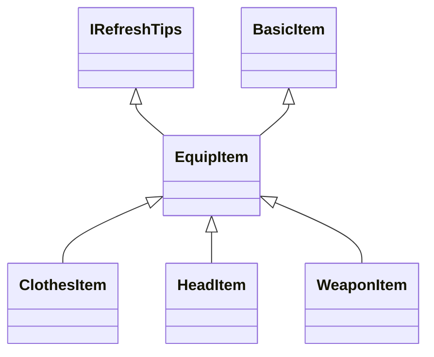

+++
title = '装备系统.md'
date = 2023-11-09T15:56:46+08:00
draft = true
+++

### 玩家装备栏：EquipCommonRole

保存了所有玩家穿在身上的装备

### 装备基类：EquipItem

继承自 BasicItem，提供装备属性、装备穿脱、装备培养等

### 装备培养

包括升级、升星、洗练等

### 数据存储

xtable.items：存放服务器上所有物品信息的表

xtable.equips：存放服务器上所有装备信息的表

xbean.item：物品信息数据类

xbean.equip：装备信息数据类

因为 EquipItem 继承自 BasicItem，所有基本信息使用 xbean.item 存储在 xtable.items 表中，然后装备所需要的信息会使用 xbean.equip 存在一个大表 xtable.equips 中，每个装备在 xtable.equips 表有一个唯一的扩展 key，xbean.item 中会有一个字段关联这个唯一的扩展 key，同时 xbean.item 中也会有一个字段表示这个物品的类型

玩家背包里会保存这个装备的 xbean.item 的唯一 key，然后通过 xbean.item 中的物品类型来判断是否是装备，如果是装备，则通过唯一的扩展 key 去 xtable.equips 表中获取装备信息