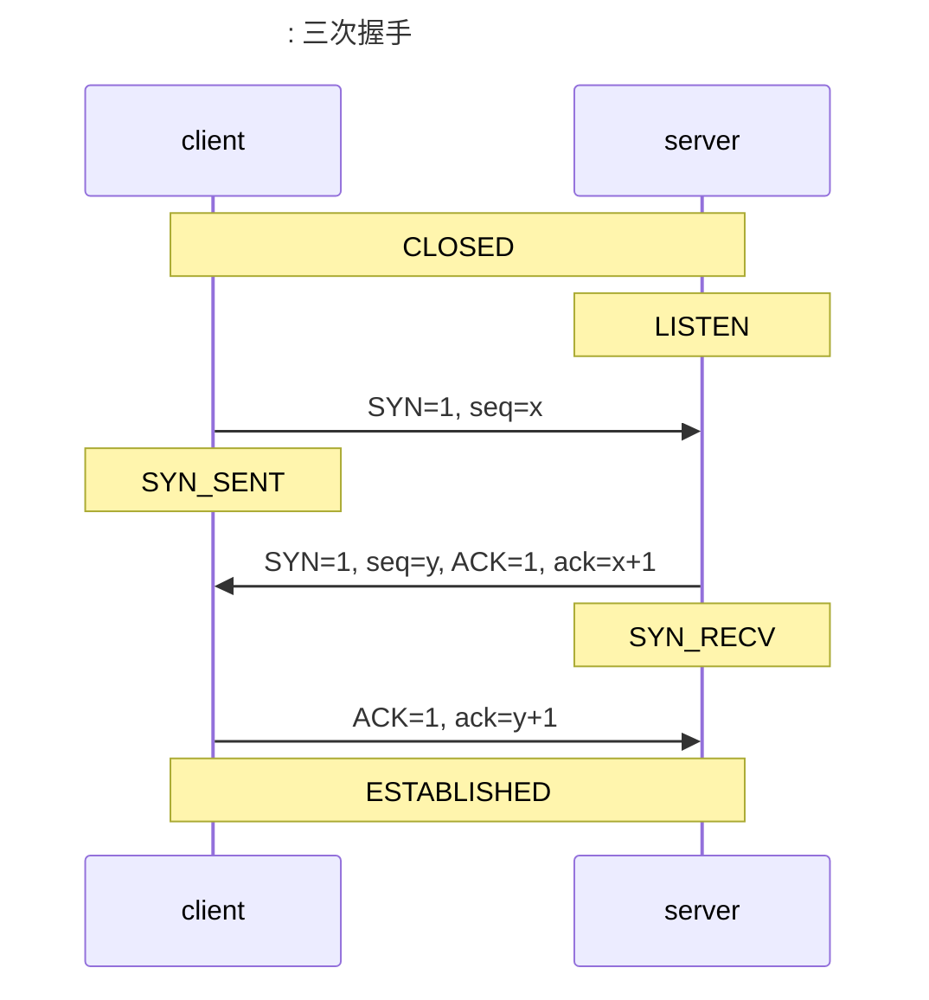
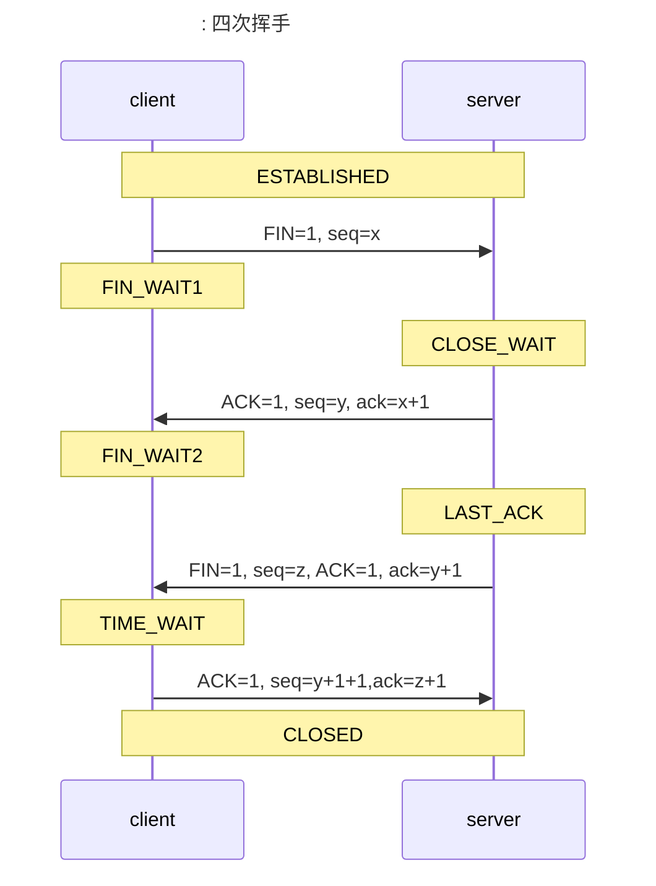

# 网络相关

## OSI 七层模型

1. 应用层：为应用程序提供网络服务。
2. 表示层：用户处理在两个通信系统中交换信息的表示方式，语法转换、语法选择、连接管理。
3. 会话层：为会话实体建立连接、维护数据传输、释放连接。
4. 传输层：为用户提供端到端服务，分割重组数据、按端口号寻址、联接管理、差错控制和流量控制、纠错功能，TCP 协议就在这一层。
5. 网络层：分组与分组交换、路由、网络连接复用、差错检测与恢复、服务选择、网络管理、流量控制、阻塞控制、网络互联、分片与重组，IP 协议在这一层。
6. 数据链路层：基本传输单位为“帧”，最基本的功能是将来自网络层的数据可靠地传输到相邻节点的目标及网络层。又被分为逻辑链路控制（LLC）协议和媒体访问控制（MAC）协议。主要提供帧编码和误差纠正控制两个功能。
7. 物理层：处于最底层，为传输数据所需要的物理链路创建、维持、拆除，而提供具有机械的、电子的、功能的和规范的特性。

## TCP/IP

> LITSEN 监听状态
>
> SYN_SENT 同步已发送
>
> SYN_RCVD 同步已收到
>
> ESTABLISHED 已建立连接

> FIN_WAIT1 终止等待1
>
> CLOSE_WAIT 关闭等待
>
> FIN_WAIT2 终止等待2
>
> LAST_ACK 最后确认
>
> TIME_WAIT 时间等待

### TCP 与 UDP

|          | TCP 可靠的、字节流服务                               | UDP 不可靠的、数据报服务               |
| -------- | ---------------------------------------------------- | -------------------------------------- |
| 面向     | 面向单一目标，面向连接的字节流协议                   | 可以面向多个目标，面向无连接的报文协议 |
| 可靠性   | 可靠的，可以保证数据无差错、不重复、不丢失、按需到达 | 不可靠，只保证发送                     |
| 消息大小 | 协议头比较大，20 个字节                              | 协议头小，8 字节                       |

## session 和 cookie

|          | session  | cookie                             |
| -------- | -------- | ---------------------------------- |
| 存储位置 | 服务端   | 客户端                             |
| 数据类型 | 任意类型 | ASCII 码字符串                     |
| 安全性   | 比较安全 | 容易被查看，有必要的话需要进行加密 |

## 常见协议默认端口号

| 协议   | 端口号 |
| ------ | ------ |
| ftp    | 21     |
| ssh    | 22     |
| telnet | 23     |
| http   | 80     |
| https  | 443    |

## ping 命令使用的是什么协议

ICMP（Internet Control Message Protocol）Internet 控制消息协议

## 分组交换

 