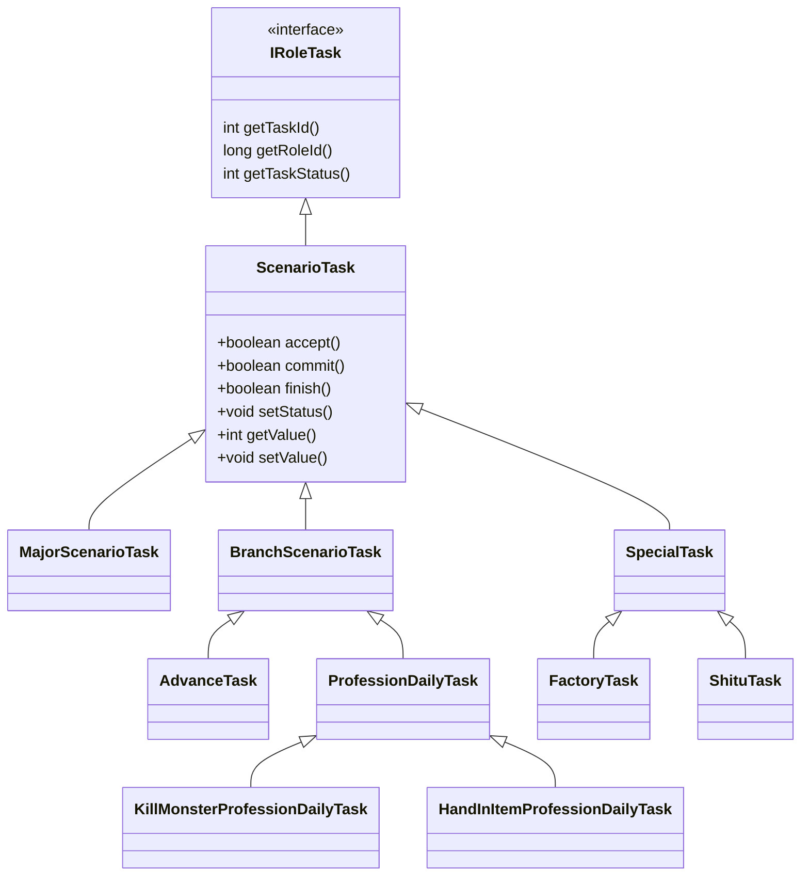

### 玩家任务 Column：ScenarioTaskColumn

包含了玩家所有类型的任务数据：主线、支线、特殊、可接任务等。

### IRoleTask 接口

提供三个接口：获取玩家 id、获取任务 id、获取任务状态。

### ScenarioTask 任务基类

保存了一个任务的通用信息：任务 id、任务进度、任务状态、接取时间等。

包含了任务所有的逻辑操作：接取、完成、放弃、失败处理、数据清理等。

### MajorScenarioTask 主线任务

继承自 ScenarioTask，使用父类的通用任务信息对象存储数据。

### BranchScenarioTask 支线任务

继承自 ScenarioTask，使用父类的通用任务信息对象存储数据。

### SpecialTask 特殊任务

继承自 ScenarioTask，使用特殊任务信息类存储数据，其中包含了一个通用任务信息对象。

除主线任务外，可以用通用任务信息类存储数据的新的任务类型都用继承 BranchTask 来做。如果是一些周期性循环任务，比如日常任务、跑环任务等，则继承 SpecialTask 来做。

